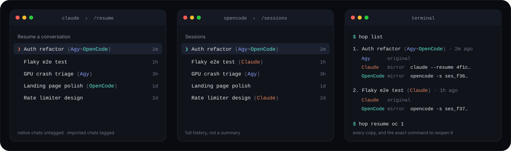
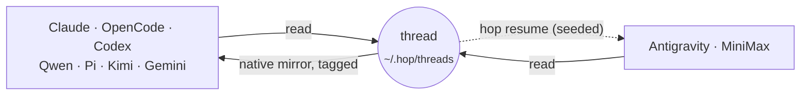

<p align="center">
  
</p>

<p align="center">
  <a href="#quick-start"></a>
  <a href="#supported-agents"></a>
  <a href="#how-it-works"></a>
</p>

<p align="center">
  
  
  <a href="https://github.com/GodrezJr2/samethread/actions/workflows/ci.yml"></a>
  <a href="LICENSE"></a>
</p>

<p align="center">
  <b>Plan it in Claude Code. Grind it out in Codex or Qwen. Finish it in Kimi.</b><br>
  SameThread puts every conversation into every agent's own <code>/resume</code> list, full history included.
</p>

---

## Why this exists

I use Claude Code for the heavy reasoning and cheaper agents for the easy stuff. Every switch meant starting from zero, because each agent keeps its history in its own private format:

| Agent | Where your chats live |
|---|---|
| Claude Code | JSONL files under `~/.claude/projects` |
| OpenCode | a SQLite database, `opencode.db` |
| Codex CLI | rollout JSONL files under `~/.codex/sessions` |
| Gemini CLI | JSONL files under `~/.gemini/tmp`, keyed by a project registry |
| Qwen Code | JSONL files under `~/.qwen/projects` |
| Pi | a JSONL entry tree under `~/.pi/agent/sessions` |
| Kimi Code | an event log plus `state.json` under `~/.kimi-code/sessions` |
| Antigravity CLI | per-conversation protobuf databases |
| MiniMax Code | a SQLite runtime database |

None of them can see the others. So you re-explain the task, paste logs again, and lose the thread.

**SameThread makes the conversation follow you.** Open any agent, hit `/resume`, and the chat you had somewhere else is there, with the whole history, tagged with where it has been.

<p align="center">
  
</p>

- **Real resume, not a summary.** The full conversation is written into each agent's own session store, so its native picker and `--resume` flags just work.
- **Automatic.** One hook per agent syncs in the background after every turn. Nothing to remember, nothing to run.
- **Tagged.** `Auth refactor (Agy)` came from Antigravity. `Auth refactor (Agy+Codex)` went through both. Your own chats stay untagged.
- **Round-trips.** Continue a mirrored chat anywhere; the next sync carries the new turns to every other agent.
- **Safe.** Originals are never modified. SameThread only rewrites the mirrors it created. `hop forget`, `hop clean` and `hop uninstall` undo everything.
- **Tiny.** One Python package, standard library only.

## Quick start

```bash
pipx install git+https://github.com/GodrezJr2/samethread   # or: pip install git+https://github.com/GodrezJr2/samethread
hop install                                                # hooks for every agent it finds
hop sync                                                   # mirror existing chats once
```

That's it. Keep working the way you do, and use each agent's own resume. `hop agents` shows what was found; `hop list` shows every copy of a chat with the command to open it.

## Supported agents

| Agent | Reads | Writes a native, resumable chat | Syncs automatically on | Verified |
|---|:---:|---|---|---|
| **Claude Code** | ✅ | ✅ JSONL session + `/rename`-style title | `Stop` + `SessionEnd` hooks | resume ✔ · hook ✔ |
| **OpenCode** 1.x | ✅ | ✅ through OpenCode's own `opencode import` | plugin, every `session.idle` | resume ✔ · hook ✔ |
| **Codex CLI** | ✅ | ✅ rollout file + `session_index` title | `notify` in `config.toml` | resume ✔ · hook ✔ |
| **Qwen Code** | ✅ | ✅ JSONL session + `custom_title` | `Stop` hook | resume ✔ · title ✔ · hook ✔ |
| **Pi** | ✅ | ✅ entry tree + `session_info` name | extension, every `agent_end` | resume ✔ · hook ✔ |
| **Kimi Code** 2.x | ✅ | ✅ event log + custom title | `[[hooks]]` `Stop` in `config.toml` | resume ✔ · hook ✔ |
| **Gemini CLI** | ✅ | ✅ in folders Gemini already knows | `AfterAgent` + `SessionEnd` hooks | listed with title ✔ |
| **Antigravity CLI** (`agy`) | ✅ | ✅ JSONL transcript + `"Other"`-tab summary row (no protobuf trajectory) | `Stop` hook | read ✔ · write ✔ · hook ✔ |
| **MiniMax Code** | ✅ | ➖ `hop resume mmx` seeds a new session | none yet: picked up by any other agent's sync | read ✔ |

"resume ✔" means a mirror written by SameThread was reopened with the agent's own resume command, and the model answered a question only the imported history could answer. Tested on Windows 11 with Claude Code 2.1.280, OpenCode 1.18.32, Codex 0.156.1, Qwen Code 0.24.4, Pi 0.87.1, Kimi Code 2.0.2, Gemini CLI 0.62 nightly, agy 1.2.9 and MiniMax Code 0.5.2. Storage paths are the same on macOS and Linux, and CI runs the tests on all three systems.

## How it works



1. **Every chat becomes a thread.** Each agent's transcript is read into a neutral format: user turns, assistant turns, tool calls and results.
2. **Mirrors are written into each agent's own store.** They're titled with the agents that wrote the conversation, and timestamped with the real last activity, so they sort naturally in the picker.
3. **Continuing a mirror is detected by message IDs.** Anything new is appended to the thread, and every other copy is rewritten, so all of them catch up.
4. **Nothing is ever lost.** If two copies are continued separately, the later one splits off as its own `[fork]` chat.
5. **Only portable parts cross over.** Tool calls from other agents arrive as readable lines (`▸ Bash: npm test` / `⎿ 2 failing`). Hidden reasoning is dropped: it's signed per provider and can't be replayed to another model.
6. **New agent installed? It gets your recent chats.** When a new agent shows up, the next sync backfills it.

## Commands

| Command | What it does |
|---|---|
| `hop sync` | Mirror new and changed chats. The hooks run this for you. |
| `hop list [-a]` | Chats for this folder (or all folders), with the exact resume command for every copy. |
| `hop resume <agent> [n]` | Open chat *n* in any agent: `cc`, `oc`, `codex`, `gemini`, `qwen`, `pi`, `kimi`, `agy`, `mmx`. For Antigravity and MiniMax it seeds a new conversation; `hop sync` also writes mirrors into Antigravity's `"Other"` tab. Turns flow back to the others. |
| `hop agents` | Which agents are installed, and how hop reaches each. |
| `hop forget <n\|title>` | Delete a chat's mirrors and stop mirroring it. |
| `hop install` / `hop uninstall` | Add or remove the hooks. `hop install` backs up every config file it touches first. |
| `hop clean --yes` | Delete every mirror SameThread ever made and reset its state. |

## Configuration

`~/.hop/config.json` is created on first run:

| Key | Default | Meaning |
|---|---|---|
| `targets` | `"auto"` | Agents to write mirrors into. `auto` means every writable agent that is installed; or list them, e.g. `["cc", "codex"]`. |
| `max_age_days` | `30` | Only chats active in this window are picked up. |
| `cc_entrypoints` | `["cli"]` | Claude sessions to include (skips `claude -p` automation runs). |
| `path_remap` | `{"C:\\Windows\\System32": "~"}` | Treat chats started in one folder as if they came from another. |
| `max_chars` | `400000` | Budget per mirrored chat, so smaller models can load it. |
| `tool_output_chars` | `1500` | Per tool result, trimmed from the middle. |
| `oc_model` | *latest used* | `provider/model` for OpenCode mirrors. |

Logs go to `~/.hop/hop.log`.

## Honest limits

- **MiniMax can't be written to.** MiniMax Code's store is a migration-managed database, so `hop resume mmx` opens a new session that reads the transcript first. Antigravity *is* written, but as a JSONL transcript + a summary row (readable, lands in the `"Other"` tab) — not agy's protobuf execution trajectory, so a mirror has no agy-native tool state.
- **Mirrors are copies, not a live shared session.** If you continue the same chat in two agents at once, you get a fork, not a merge.
- **Long chats get trimmed.** They start from the latest compaction summary if there is one, then keep the newest messages that fit in `max_chars`.
- **Some agents need a first run.** Gemini CLI mirrors go only into folders Gemini has already opened. Kimi mirrors copy the agent profile from your newest real Kimi session. OpenCode needs the chat's folder to still exist.
- **Codex has one `notify` slot.** If you already use it, hop leaves it alone, and Codex chats sync whenever another agent does.
- **These are private formats.** An agent update can break a reader. Check `~/.hop/hop.log` and open an issue.

## How it compares

| | **SameThread** | [casr](https://github.com/Dicklesworthstone/cross_agent_session_resumer) | [agent-session-resume](https://github.com/hacktivist123/agent-session-resume) |
|---|:---:|:---:|:---:|
| Chat shows up in the target's native `/resume` | ✅ | ✅ | ❌ handoff summary |
| Writes into current OpenCode (1.x) and Kimi Code | ✅ | ❌ | ➖ |
| Automatic sync through hooks | ✅ | ❌ one-shot | ❌ one-shot |
| Round-trips with source tags | ✅ | ❌ | ❌ |
| Number of agents | 9 | 15+ | 6 |

casr covers more agents. Reach for it when you need a one-off conversion to something like Cursor or Aider. SameThread is for people who switch between agents all day and want it to be invisible.

## Roadmap

- [ ] Cursor CLI and Crush adapters
- [ ] `pipx install samethread` from PyPI
- [ ] Native MiniMax writes, if it ships an import API (Antigravity's protobuf trajectory, so mirrors get real tool state)
- [ ] Optional merge of forks

Adding an agent is one file in [`src/samethread/agents/`](src/samethread/agents/): a lister, a reader and, if the agent allows it, a writer and a hook. PRs welcome.

## Development

```bash
git clone https://github.com/GodrezJr2/samethread && cd samethread
pip install -e .
python -m unittest discover -s tests -v
```

## Star history

<a href="https://star-history.com/#GodrezJr2/samethread&Date">
  
</a>

## License

[MIT](LICENSE)
