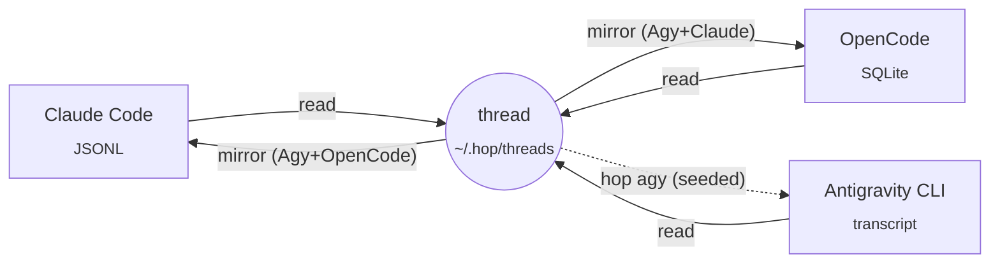

<p align="center">
  
</p>

<p align="center">
  <a href="#quick-start"></a>
  <a href="#supported-agents"></a>
  <a href="#how-it-works"></a>
</p>

<p align="center">
  
  
  <a href="https://github.com/GodrezJr2/samethread/actions/workflows/ci.yml"></a>
  <a href="LICENSE"></a>
</p>

<p align="center">
  <b>Start a chat in Claude Code. Continue it in OpenCode. Pick it up in Antigravity.</b><br>
  SameThread puts every conversation into every agent's own <code>/resume</code> list, full history included.
</p>

---

## Why this exists

I use Claude Code for the heavy reasoning and cheaper agents (OpenCode, Antigravity CLI) for the easy stuff. Every switch meant starting from zero. Each agent keeps its history in its own private format:

| Agent | Where your chats live |
|---|---|
| Claude Code | JSONL files under `~/.claude/projects` |
| OpenCode | a SQLite database, `opencode.db` |
| Antigravity CLI | per-conversation protobuf databases |

None of them can see the others. So you re-explain the task, paste logs again, and lose the thread.

**SameThread makes the conversation follow you.** Open any agent, hit `/resume`, and the chat you had somewhere else is there, with the whole history, tagged with where it has been.

<p align="center">
  
</p>

- **Real resume, not a summary.** The full conversation is written into the agent's own session store, so its native picker and `--resume` flags just work.
- **Automatic.** One hook per agent syncs in the background after every turn. Nothing to remember, nothing to run.
- **Tagged.** `Auth refactor (Agy)` came from Antigravity. `Auth refactor (Agy+OpenCode)` went through both. Your own chats stay untagged.
- **Round-trips.** Continue a mirrored chat anywhere; the next sync carries the new turns to every other agent.
- **Safe.** Originals are never modified. SameThread only rewrites the mirrors it created. `hop forget`, `hop clean` and `hop uninstall` undo everything.
- **Tiny.** One Python package, standard library only.

## Quick start

```bash
pipx install git+https://github.com/GodrezJr2/samethread   # or: pip install git+https://github.com/GodrezJr2/samethread
hop install                                                # hooks for Claude Code, OpenCode and Antigravity CLI
hop sync                                                   # mirror existing chats once (about a minute)
```

That's it. Keep working the way you do, and use each agent's own resume:

```text
claude  →  /resume          opencode  →  /sessions          hop list  →  every copy + the command to open it
```

## Supported agents

| Agent | Reads | Writes a native, resumable chat | Syncs automatically on | Open with |
|---|:---:|---|---|---|
| **Claude Code** | ✅ | ✅ JSONL session with a `/rename`-style title | `Stop` + `SessionEnd` hooks | `/resume`, `claude --resume <id>` |
| **OpenCode** 1.x | ✅ | ✅ through OpenCode's own `opencode import` | plugin, on every `session.idle` | `/sessions`, `opencode -s <id>` |
| **Antigravity CLI** (`agy`) | ✅ | ➖ no import API yet; `hop agy` seeds a new conversation with the transcript | `Stop` hook in `~/.gemini/config/hooks.json` | `agy --conversation <id>` |
| Codex CLI, Gemini CLI, Cursor | 🔜 | 🔜 | | |

Tested on Windows 11 with Claude Code 2.1.280, OpenCode 1.18.32 and agy 1.2.9. The storage paths are the same on macOS and Linux, and CI runs the test suite on all three systems.

## How it works



1. **Every chat becomes a thread.** Each agent's transcript is read into a neutral format: user turns, assistant turns, tool calls and results.
2. **Mirrors are written into each agent's own store.** They're titled with the agents that wrote the conversation, and timestamped with the real last activity, so they sort naturally in the picker.
3. **Continuing a mirror is detected by message IDs.** Anything new is appended to the thread, and every other copy is rewritten, so all of them catch up.
4. **Nothing is ever lost.** If two copies are continued separately, the later one splits off as its own `[fork]` chat.
5. **Only portable parts cross over.** Tool calls from other agents arrive as readable lines (`▸ Bash: npm test` / `⎿ 2 failing`). Hidden reasoning is dropped: it's signed per provider and can't be replayed to another model.

## Commands

| Command | What it does |
|---|---|
| `hop sync` | Mirror new and changed chats. The hooks run this for you. |
| `hop list [-a]` | Chats for this folder (or all folders), with the exact resume command for every copy. |
| `hop resume cc\|oc [n]` | Open chat *n* from the list in Claude Code or OpenCode. |
| `hop agy [n]` | Continue chat *n* in Antigravity CLI. New turns flow back to the other agents. |
| `hop forget <n\|title>` | Delete a chat's mirrors and stop mirroring it. |
| `hop install` / `hop uninstall` | Add or remove the hooks. `hop install` backs up every config file it touches first. |
| `hop clean --yes` | Delete every mirror SameThread ever made and reset its state. |

## Configuration

`~/.hop/config.json` is created on first run:

| Key | Default | Meaning |
|---|---|---|
| `targets` | `["cc", "oc"]` | Agents to write mirrors into. |
| `max_age_days` | `30` | Only chats active in this window are picked up. |
| `cc_entrypoints` | `["cli"]` | Claude sessions to include (skips `claude -p` automation runs). |
| `path_remap` | `{"C:\\Windows\\System32": "~"}` | Treat chats started in one folder as if they came from another. |
| `max_chars` | `400000` | Budget per mirrored chat, so smaller models can load it. |
| `tool_output_chars` | `1500` | Per tool result, trimmed from the middle. |
| `oc_model` | *latest used* | `provider/model` for OpenCode mirrors. |

Logs go to `~/.hop/hop.log`.

## Honest limits

- **Antigravity can't be written to.** Its conversations are protobuf the runtime owns, and there's no import command. `hop agy` is the workaround: it opens a new agy conversation that reads the transcript first.
- **Mirrors are copies, not a live shared session.** If you continue the same chat in two agents at once, you get a fork, not a merge.
- **Long chats get trimmed.** They start from the latest compaction summary if there is one, then keep the newest messages that fit in `max_chars`.
- **OpenCode needs the folder to exist.** Chats from deleted folders are mirrored to Claude only.
- **These are private formats.** An agent update can break a reader. Check `~/.hop/hop.log` and open an issue.

## How it compares

| | **SameThread** | [casr](https://github.com/Dicklesworthstone/cross_agent_session_resumer) | [agent-session-resume](https://github.com/hacktivist123/agent-session-resume) |
|---|:---:|:---:|:---:|
| Chat shows up in the target's native `/resume` | ✅ | ✅ | ❌ handoff summary |
| Writes into current OpenCode (1.x) | ✅ | ❌ read-only | ➖ |
| Automatic sync through hooks | ✅ | ❌ one-shot | ❌ one-shot |
| Round-trips with source tags | ✅ | ❌ | ❌ |
| Number of agents | 3 | 15+ | 6 |

casr covers far more agents. Reach for it when you need a one-off conversion between, say, Codex and Cursor. SameThread is for people who switch between a few agents all day and want it to be invisible.

## Roadmap

- [ ] Codex CLI and Gemini CLI adapters
- [ ] `pipx install samethread` from PyPI
- [ ] Real agy writes, if Antigravity ships an import API
- [ ] Optional merge of forks

Adding an agent takes about 100 lines: a lister, a reader and, if the agent allows it, a writer. See the per-agent sections in [`src/samethread/cli.py`](src/samethread/cli.py). PRs welcome.

## Development

```bash
git clone https://github.com/GodrezJr2/samethread && cd samethread
pip install -e .
python -m unittest discover -s tests -v
```

## Star history

<a href="https://star-history.com/#GodrezJr2/samethread&Date">
  
</a>

## License

[MIT](LICENSE)
